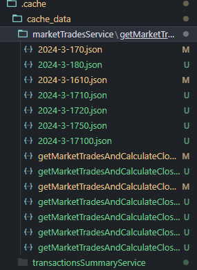
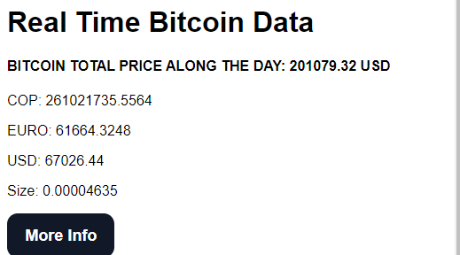
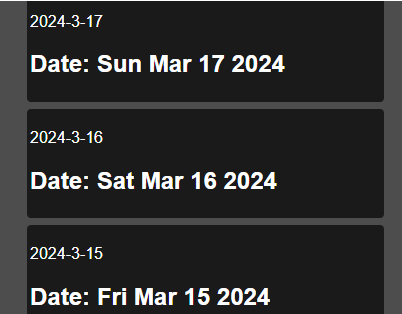
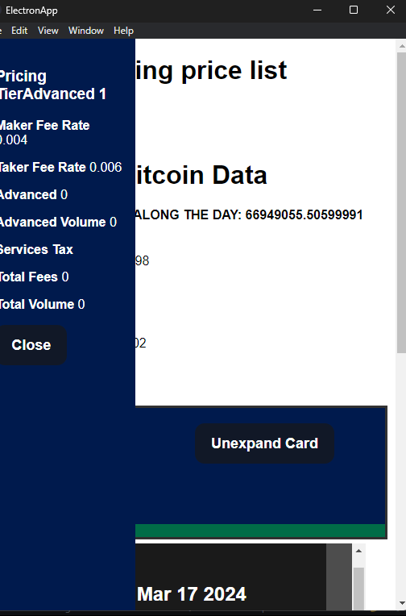
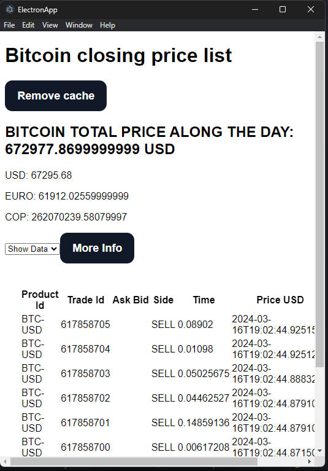

# WELCOME TO THE BITCOIN STATE VIEWER

The Bitcoin State Viewer is a desktop application built using Electron.js and Angular. Its primary function is to provide up-to-date information about Bitcoin, including its closing value and relevant data for the current day's trading activity. Additionally, it offers insights into Bitcoin's performance over the past two weeks.

## CURRENT FEATURES

- Real-time display of Bitcoin's closing value.
- Insights into Bitcoin's trading activity for the current day.
- Historical data retrieval for the past two weeks.
- Offline functionality for seamless operation without an internet connection.

"Hi tekus 👋"

## Final Overview

Hello,

In this final overview, I'll provide a brief summary of how the app was constructed.

- Data Handling: Internally, the app utilizes Electron's inter-process communication to effectively manage and structure API data. Error handling is streamlined through a custom `uswFetch` function, which efficiently manages errors and integrates with an error dialog for user feedback.

- Caching Mechanism: Leveraging Streams and optimized methods, the app implements robust caching functionalities. This includes features such as cache clearing, retrieval, reading, existence checks, and more. With these mechanisms in place, the app can seamlessly access data even in offline scenarios.

- Logical Separation: To maintain clarity and organization, the app neatly separates Electron utilities from Angular components. This ensures that each part of the application utilizes appropriate methods without interference, promoting cleaner and more maintainable code.

(I have'nt fixe the issue about the current bitcoin value until now. My apologies)

